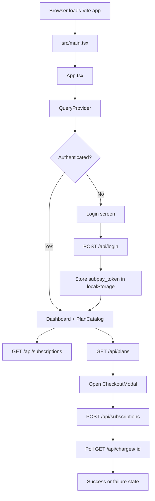

# SubPay Frontend

SubPay Frontend is the Vite + React + TypeScript application that powers the subscriber and operator experience for the SubPay billing system.

It is responsible for:

- authenticating the user with the backend
- loading subscription plans and active subscriptions
- starting M-Pesa subscription checkout flows
- polling charge status until payment completes or fails
- presenting a separate admin console for operational review

This README is written as an implementation guide. It is meant to help explain the frontend in an interview and to make the architecture easy to review later.

---

## High-Level Architecture

The frontend is intentionally thin. It does not store business state in a custom global store. Instead, it relies on:

- React component state for local UI state such as modal visibility and form inputs
- TanStack Query for all backend-derived data
- Axios for API access and auth header injection
- Tailwind CSS v4 for styling and responsive layout

The application flow is:



---

## Project Structure

Important frontend files:

- [src/main.tsx](src/main.tsx) bootstraps the app, imports global CSS, and renders React into `#root`
- [src/App.tsx](src/App.tsx) owns authentication gating and page-level composition
- [src/providers/QueryProvider.tsx](src/providers/QueryProvider.tsx) configures TanStack Query
- [src/api/client.ts](src/api/client.ts) creates the shared Axios client and attaches auth tokens
- [src/hooks/useBillingData.ts](src/hooks/useBillingData.ts) fetches plans and subscriptions
- [src/hooks/usePaymentFlow.ts](src/hooks/usePaymentFlow.ts) handles subscription creation and charge polling
- [src/hooks/useAdminData.ts](src/hooks/useAdminData.ts) powers admin subscription and charge views
- [src/components/Login.tsx](src/components/Login.tsx) renders the auth form and login mutation
- [src/components/Dashboard.tsx](src/components/Dashboard.tsx) renders subscription status and charge history
- [src/components/PlanCatalog.tsx](src/components/PlanCatalog.tsx) lists plans and launches checkout
- [src/components/CheckoutModal.tsx](src/components/CheckoutModal.tsx) manages payment submission and polling states
- [src/components/CheckoutForm.tsx](src/components/CheckoutForm.tsx) validates phone input before checkout
- [src/components/AdminDashboard.tsx](src/components/AdminDashboard.tsx) provides the operator console for subscriptions, charges, and telemetry

---

## Boot Sequence

### `src/main.tsx`

The app entry point does three things:

1. imports the global stylesheet
2. forces dark mode on the root document element
3. renders `<App />` inside React Strict Mode

The root document is intentionally dark by default so the interface matches the operator-console visual language without relying on system color scheme.

### `src/App.tsx`

`App.tsx` is the top-level composition layer. It decides whether to show the login screen or the authenticated workspace.

Current auth check:

- if `localStorage` contains `subpay_token`, the user is treated as authenticated
- otherwise the login view is shown

This is a simple client-side gate. The backend still enforces real authorization on protected endpoints.

When authenticated, the app renders:

- `Dashboard` for subscription state and charge history
- `PlanCatalog` for plan selection
- `CheckoutModal` when a plan is selected

---

## Styling System

The current visual design is built with Tailwind CSS v4 and a custom dark background in [src/index.css](src/index.css).

Key style decisions:

- near-black background with layered radial lighting
- glassmorphism panels using translucent surfaces and blurred backdrops
- cyan/emerald accent gradients for primary actions
- high-contrast type for headings and muted slate text for secondary copy
- large rounded corners for cards, modals, and inputs

This was chosen to make the product feel more like an operator dashboard than a generic CRUD app.

### Tailwind setup

Tailwind is wired through the Vite plugin in [vite.config.ts](vite.config.ts), and the stylesheet imports Tailwind with:

```css
@import 'tailwindcss';
```

That means the utility classes used throughout the components are generated correctly during dev and production builds.

---

## Data and API Layer

### `src/api/client.ts`

All HTTP calls go through a shared Axios client.

Responsibilities:

- sets `Content-Type` and `Accept` to JSON
- uses `VITE_API_BASE_URL` when provided
- falls back to `http://localhost:8000` for local development
- attaches `Authorization: Bearer <token>` automatically when `subpay_token` exists

That interceptor is the main connection between the browser session and the backend auth model.

### API endpoints used by the frontend

The frontend currently talks to these endpoints:

- `POST /api/login` for authentication
- `GET /api/plans` for subscription plan discovery
- `GET /api/subscriptions` for the current user subscription history
- `POST /api/subscriptions` to initiate a new subscription checkout
- `GET /api/charges/:id` to poll a specific charge
- `GET /api/admin/subscriptions` for operator views
- `GET /api/admin/charges` for operator views
- `POST /api/admin/charges/:id/refund` for reversals

The frontend expects JSON responses from all of them.

---

## TanStack Query

TanStack Query is the frontend data engine. It handles server state, background fetching, caching, and retry behavior.

### `src/providers/QueryProvider.tsx`

The `QueryProvider` creates one shared `QueryClient` for the app and wraps the component tree with `QueryClientProvider`.

Configured defaults:

- `retry: 1` to avoid aggressive retries on transactional endpoints
- `refetchOnWindowFocus: false` to prevent surprise refreshes while switching tabs
- `staleTime: 30 seconds` so recently fetched data is reused briefly

Those defaults are a good fit for billing flows where you want freshness, but not noisy repeated requests.

### Why TanStack Query instead of manual `useEffect`

For this app, TanStack Query is useful because it gives:

- consistent loading and error states
- built-in request deduplication
- query invalidation hooks for future mutations
- polling support for the payment lifecycle
- separation between server state and local UI state

In an interview, the key point is that subscriptions, plans, and charges are server state, so they belong in a query library rather than in ad hoc component state.

### Query keys used

Current query keys are intentionally small and descriptive:

- `['plans']`
- `['my-subscriptions']`
- `['charge', chargeId]`
- `['admin-subscriptions', statusFilter]`
- `['admin-charges', statusFilter]`

These keys define cache identity and are the handle used later for invalidation or future refetch logic.

---

## Hooks

The hooks are the main abstraction boundary in the frontend. Components mostly render UI; hooks own the data access logic.

### `useBillingData.ts`

This file defines the frontend types and the main billing queries.

#### Types

- `Plan` models a subscription plan returned by the backend
- `Charge` models a payment attempt and includes `status`, `mpesa_receipt`, and optional `failure_reason`
- `Subscription` models the current subscription together with its plan and related charges

#### `usePlans()`

Fetches the list of plans from `/api/plans`.

Used by:

- `PlanCatalog`

This hook is ideal for showing available products before checkout.

#### `useMySubscriptions()`

Fetches the current user subscription list from `/api/subscriptions`.

Used by:

- `Dashboard`

This is the query that renders the active plan summary and billing history.

### `usePaymentFlow.ts`

This file controls the checkout lifecycle.

#### `useSubscribeMutation()`

Creates a new subscription checkout by posting `plan_id` and `phone` to `/api/subscriptions`.

Behavior:

- sends the selected plan and Safaricom phone number to the backend
- expects a response containing a `subscription_id` and nested `charge`
- the returned `charge.id` is then used as the polling target

#### `usePaymentPolling(chargeId, isEnabled)`

Polls `/api/charges/:id` until the payment is no longer pending.

Behavior:

- only runs when a charge ID exists and polling is enabled
- refetches every 3 seconds while the charge status is `pending`
- stops automatically when the backend reports `completed` or `failed`

This is the most important realtime interaction in the frontend.

### `useAdminData.ts`

This file powers the operator console.

#### `useAdminSubscriptions(statusFilter?)`

Fetches filtered subscription data from `/api/admin/subscriptions`.

#### `useAdminCharges(statusFilter?)`

Fetches filtered charges from `/api/admin/charges`.

#### `useRefundMutation()`

Calls `/api/admin/charges/:id/refund` and then invalidates admin query caches.

This is a good example of mutation-driven cache invalidation with TanStack Query.

---

## UI Components

### `Login.tsx`

The login component is a controlled form with local state for `email`, `password`, and `formError`.

It performs:

- field-level controlled input updates
- simple required-field validation before submit
- `POST /api/login` through a TanStack Query mutation
- token persistence in `localStorage`
- callback to the parent on success

Why this is structured well:

- the form state stays local
- the auth side effect is isolated in one mutation
- the parent only needs to know success or failure

### `Dashboard.tsx`

The dashboard consumes `useMySubscriptions()` and renders three states:

- loading state
- error state
- empty-state or populated subscription data

When data exists, it shows:

- current plan name
- subscription status
- current period end
- next scheduled charge
- billing and payment history table

This component is mostly presentational, which is a good sign for maintainability.

### `PlanCatalog.tsx`

The plan catalog uses `usePlans()` and renders all available billing plans.

For each plan it shows:

- name
- billing cycle
- amount
- subscribe button

Clicking a plan opens the checkout modal through `setSelectedPlan` in the parent app.

### `CheckoutModal.tsx`

This component owns the payment lifecycle after a plan has been selected.

It is responsible for:

- focus trapping and Escape handling
- rendering the phone number form
- submitting the checkout mutation
- starting charge polling after the backend returns a charge ID
- switching between pending, success, and failed states

Key behavior:

- submit the phone number in `CheckoutForm`
- create a subscription checkout
- store the returned charge ID
- start polling every 3 seconds
- stop polling when the charge resolves

This is one of the best interview examples of coordinating local UI state with server state.

### `CheckoutForm.tsx`

This is the form used inside the modal.

It validates Safaricom phone numbers before triggering checkout.

Validation rules:

- accepts local and international Kenyan formats such as `0712345678` or `254712345678`
- rejects invalid numbers before contacting the backend

### `AdminDashboard.tsx`

This component provides a separate operator console for staff workflows.

It has three tabs:

- subscriptions
- charges
- telemetry

The telemetry tab embeds a Grafana dashboard for operational metrics.

Note: this component exists in the codebase as a standalone admin view, but it is not currently mounted in the main `App` shell.

---

## Authentication Flow

Current auth is intentionally simple on the frontend:

1. user submits email and password
2. `/api/login` returns a token
3. the token is stored in `localStorage` as `subpay_token`
4. Axios request interceptor adds the token to future API calls
5. the app switches into the authenticated UI

This is a common SPA pattern for bearer-token-based auth.

Interview note:

- the frontend is only responsible for storing and forwarding the token
- the backend must still validate token scope and permissions on every protected request

---

## Payment Flow

The checkout flow is the core product behavior.

1. user selects a plan from `PlanCatalog`
2. `CheckoutModal` opens
3. user enters a phone number in `CheckoutForm`
4. `useSubscribeMutation()` posts the checkout request
5. backend returns a charge ID
6. `usePaymentPolling()` polls the charge endpoint
7. modal transitions to success or failure based on status
8. on success, the page reloads so the dashboard reflects the latest subscription state

Why polling is used here:

- M-Pesa/STK Push is asynchronous
- the browser needs to keep checking until the backend knows the outcome
- query polling is simpler than introducing websocket infrastructure for this use case

---

## Data Shapes

The frontend is typed around the backend responses.

### `Plan`

```ts
{
  id: string;
  name: string;
  amount: number;
  billing_cycle: 'daily' | 'weekly' | 'monthly';
  trial_days: number;
  grace_period_days: number;
  is_active: boolean;
}
```

### `Charge`

```ts
{
  id: string;
  amount: number;
  status: 'pending' | 'completed' | 'failed' | 'refunded';
  checkout_request_id: string;
  mpesa_receipt: string | null;
  failure_reason?: string | null;
  created_at: string;
}
```

### `Subscription`

```ts
{
  id: string;
  status: 'trialing' | 'active' | 'past_due' | 'paused' | 'cancelled';
  trial_ends_at: string | null;
  current_period_start: string;
  current_period_end: string;
  next_billing_at: string;
  plan: Plan;
  charges: Charge[];
}
```

These types are an important part of the implementation because they make the UI contract explicit.

---

## Environment Variables

Frontend runtime configuration:

- `VITE_API_BASE_URL` sets the backend base URL

If it is not set, the app falls back to `http://localhost:8000`.

Example:

```bash
VITE_API_BASE_URL=http://localhost:8000
```

---

## Development Commands

From the `subpay-frontend` directory:

```bash
npm install
npm run dev
npm run build
npm run lint
```

### What each command does

- `npm run dev` starts the Vite development server
- `npm run build` type-checks and creates a production bundle
- `npm run lint` runs ESLint across the frontend codebase

---

## Interview Talking Points

If you need to explain the frontend in an interview, these are the strongest points:

1. The app separates server state from UI state. TanStack Query owns all remote data, while React state only handles local interaction details.
2. The API client is centralized. Authentication headers are injected once in Axios instead of being repeated in every component.
3. The payment flow is asynchronous by design. Checkout creates a charge, then polling resolves the final state.
4. The UI is componentized around user journeys. Login, dashboard, plan selection, and checkout each have a focused responsibility.
5. The styling system is coherent. Tailwind v4 plus a custom dark glass theme gives the app a distinct operator-console identity.
6. The code uses TypeScript interfaces to make backend contracts visible in the UI layer.

---

## Current Implementation Notes

- The authenticated main shell currently renders `Dashboard` and `PlanCatalog`.
- `AdminDashboard` exists as a separate implementation but is not yet wired into the main app navigation.
- The app uses `localStorage` for token persistence, which is suitable for this prototype but could be revisited for a stricter security posture.

---

## Troubleshooting

- If the app looks unstyled, confirm that Tailwind is installed in `subpay-frontend` and that `vite.config.ts` includes the Tailwind plugin.
- If API calls fail, check `VITE_API_BASE_URL` and confirm the backend is listening on the expected port.
- If authenticated requests fail unexpectedly, verify that `subpay_token` exists in `localStorage` and that the backend accepts the bearer token.
- If checkout stays pending forever, inspect the backend charge status endpoint and ensure the polling endpoint returns the updated charge state.

---

## Why This Design Works

This frontend is a good interview example because it shows a pragmatic split between concerns:

- React handles presentation and local interaction
- TanStack Query handles asynchronous backend data
- Axios handles transport and auth wiring
- Tailwind handles consistent product styling
- TypeScript keeps the backend contract explicit

That combination keeps the implementation understandable while still being production-shaped.

